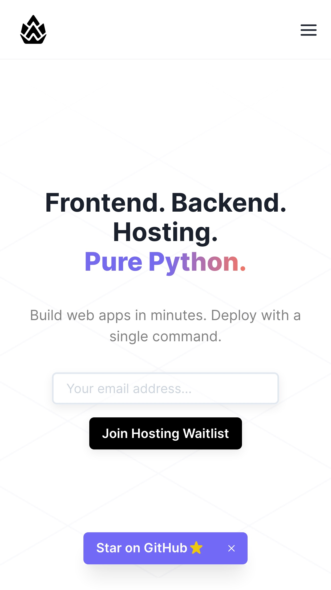
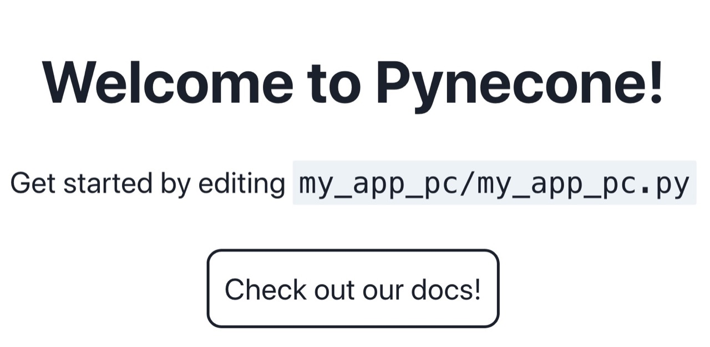

### Pynecone

> [Pynecone](https://pynecone.io/) is a full-stack framework for building and deploying web apps.
>
> Use <b>Python</b> for everything. 


[](https://pynecone.io/docs/gallery)

---

# Installation | Pynecone

> Write web apps in pure Python. Deploy in minutes.


Pynecone is available as a [pip](https://pypi.org/project/pynecone) library:

```
$ pip install pynecone
```

## Create a Project

___

Installing Pynecone also installs the `pc` command line tool.

Test that the install was successful by creating a new project. Replace `my_app_name` with your project name:

```
$ mkdir my_app_name
$ cd my_app_name
$ pc init
```

This initializes a template app in your new directory.

## Run the App

___

You can run this app in development mode:

```
$ pc run
```

You should see your app running at [http://localhost:3000](http://localhost:3000).

---

```bash
[pynecone]
.
└── my_app_pc
    ├── assets
    │   └── favicon.ico
    ├── my_app_pc
    │   ├── __pycache__
    │   ├── my_app_pc.py
    │   └── __init__.py
    ├── .web
    │   ├── pages
    │   ├── public
    │   ├── styles
    │   ├── utils
    │   ├── bun.lockb
    │   ├── next.config.js
    │   ├── package.json
    │   ├── pynecone.json
    │   └── .gitignore
    ├── __pycache__
    │   └── pcconfig.cpython-39.pyc
    ├── pcconfig.py
    ├── pynecone.db
    └── .gitignore
```

